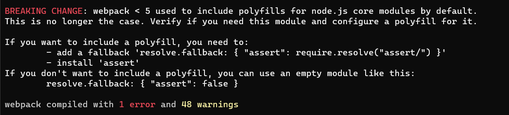

# solana-gif-portal

# Description

A GIF Portal web app built with Solana, Anchor, Web3 and React.js that displays a list of user-generated gifs.

# Pre-requisites

- Fundamental understanding of solana framework
- Fundamental understanding of React
- Fundamental understanding of Rust

# Project Structure

```
/myepicsolanaproject -> backend

/gif-portal-frontend -> frontend
```

# Issues Encountered

While I was building this project, I encountered issues with the react library and project-serum/anchor library. Screenshots of the issues encountered below:



Most of the issues stem from the ``@project-serum/anchor`` library.

# Solutions to the issues includes:

- [How to Polyfill node core modules in webpack 5](https://stackoverflow.com/questions/64557638/how-to-polyfill-node-core-modules-in-webpack-5)
- [resolve.fallback fails for linked packages](https://github.com/webpack/webpack/issues/11600)

# Getting Started

To get started with this course, clone this repo and follow these commands:

1. Run `npm install` at the root of your directory
2. Run `npm run start` to start the project
3. Start coding!

# Web Preview

Open page in supported browsers such as Brave, chrome with web3 wallets support.

[Live Link]()


# Resources

[Build a Solana + Rust app](https://buildspace.so/p/build-solana-web3-app/lessons/finishing-touches-web-app-and-program)
